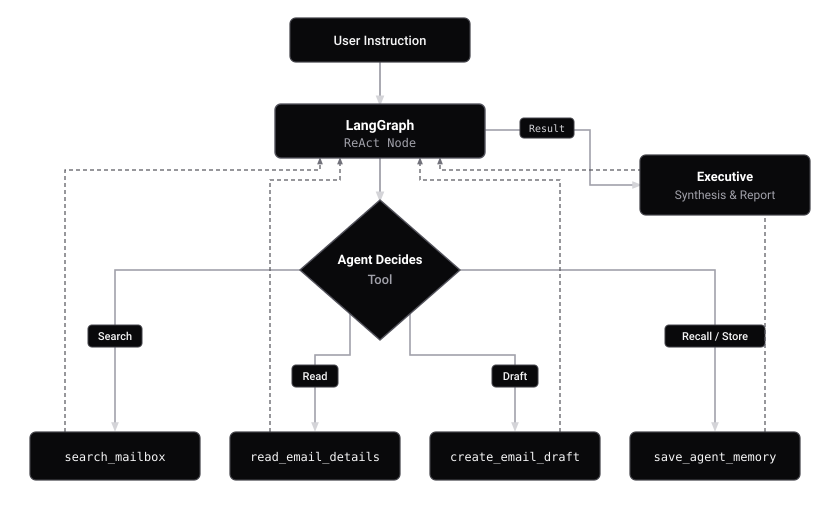

<p align="center">
  
  <strong style="font-size: 36px; vertical-align: middle;">inboxgpt</strong>
</p>

<p align="center">
  <a href="https://www.npmjs.com/package/inboxgpt"><picture><source media="(prefers-color-scheme: dark)" srcset="https://shieldcn.dev/npm/inboxgpt.svg?variant=outline&amp;font=geist" /></picture></a>
  <a href="https://github.com/bhagirath00/inboxgpt"><picture><source media="(prefers-color-scheme: dark)" srcset="https://www.shieldcn.dev/github/license/bhagirath00/inboxgpt.svg?variant=outline&amp;font=geist" /></picture></a>
  <a href="https://github.com/bhagirath00/inboxgpt"><picture><source media="(prefers-color-scheme: dark)" srcset="https://www.shieldcn.dev/github/stars/bhagirath00/inboxgpt.svg?variant=outline&amp;mode=dark&amp;font=geist" /></picture></a>
  <a href="https://github.com/bhagirath00/inboxgpt"><picture><source media="(prefers-color-scheme: dark)" srcset="https://shieldcn.dev/views/repo/bhagirath00/inboxgpt.svg?variant=outline&amp;mode=dark&amp;font=geist" /></picture></a>
</p>

Terminal-first AI Gmail executive assistant powered by LangGraph, Google Gemini, and Textual TUI with human-in-the-loop safety.

* Lightning-fast keyboard navigation inspired by lazygit and Vim.
* Autonomous LangGraph ReAct agent with email search, context reading, draft generation, and long-term memory.
* Inviolable safety guardrails: Starred, Priority, OTPs, 2FA codes, and financial receipts can never be trashed.
* Zero permanent deletions: Archive cleanly removes the Inbox label while preserving everything in "All Mail".
* Background daemon for automated executive morning briefings and action item digests.
* Multi-account management with seamless switching and token auto-refresh.


## Quickstart

Run directly without cloning:

```bash
npx inboxgpt
```

Or install globally:

```bash
npm install -g inboxgpt
inboxgpt
```


## Architecture

<p align="center">
  
</p>

### Integrated Agent Tools
* `search_mailbox`: Runs search queries across your inbox (`is:unread`, `from:someone`, date filters).
* `read_email_details`: Retrieves complete email bodies and thread context.
* `create_email_draft`: Composes replies as drafts in Gmail without sending without approval.
* `save_agent_memory`: Retains persistent user instructions across sessions in `~/.inboxgpt/agent_memory.json`.


## Keyboard Controls

| Key | Action | Description |
| :---: | :--- | :--- |
| `↑` / `↓` | **Navigate** | Scroll through emails |
| `Enter` | **Reader** | Open full email reader view |
| `1` – `5` | **Filter** | Switch category tabs: All, Priority, Promo, Social, News |
| `e` | **Archive** | Archive email (safe remove from Inbox, kept in All Mail) |
| `d` | **Trash** | Move email to Bin/Trash |
| `x` | **Select** | Toggle multi-selection checkbox |
| `r` | **Sync** | Sync latest emails from Gmail API |
| `a` | **Inbox Agent** | Trigger Gemini AI Agent dialog |
| `l` | **Switch Account** | Switch / Logout active Gmail account |
| `?` | **Help** | Open keybindings cheat sheet |
| `Esc` / `q` | **Back / Quit** | Return to list view or exit application |


## License

Distributed under the MIT License. See [LICENSE](https://github.com/bhagirath00/inboxgpt/blob/main/LICENSE) for details.
