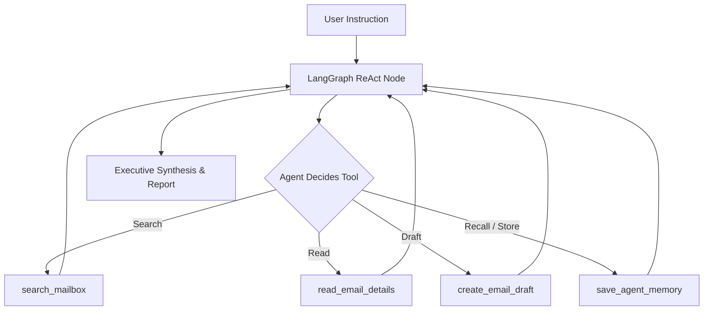

<div align="center">

# 📬 InboxGPT

### **The Terminal-First AI Gmail Executive Assistant**
*Powered by **LangGraph**, **Google Gemini**, and a high-performance **Textual TUI** with strict Human-in-the-Loop safety guardrails.*

<br/>

[](https://www.npmjs.com/package/inboxgpt)
[](https://www.npmjs.com/package/inboxgpt)
[](https://www.python.org/downloads/)
[](https://langchain-ai.github.io/langgraph/)
[](https://opensource.org/licenses/MIT)
[](https://github.com/bhagirath00/InboxGPT/pulls)

<br/>

```bash
# Run instantly with zero setup
npx inboxgpt
```

</div>

---

## 🖥️ Terminal Interface Preview

```text
┌── [InboxGPT] ────────────────────────────────────────────────────────────────────────┐
│ [1] ALL (12)  [2] PRIORITY (4)  [3] PROMO (3)  [4] SOCIAL (2)  [5] NEWS (3)          │
├──────────────────────────────────────────────────────────────────────────────────────┤
│ ● [PRIO]  Sarah Connor        URGENT: Q3 Security Audit & Production Release signoff │
│ ● [PRIO]  Stripe Billing      Your Stripe Monthly Invoice #INV-2026-9938 is ready    │
│   [NEWS]  TLDR Tech           TLDR AI: Gemini 3.5 & LangGraph production blueprints  │
│   [SOC]   LinkedIn Updates    3 recruiters viewed your profile this week             │
│   [PROMO] AWS Cloud           Special credit offers available for your account       │
├──────────────────────────────────────────────────────────────────────────────────────┤
│ 💡 AI COPILOT [Space / a]                                                            │
│ > "Draft a polite confirmation to Sarah and summarize today's newsletters"           │
│                                                                                      │
│ 🤖 Agent: Inspecting thread ... Drafting reply ... Memory saved to agent profile.    │
└──────────────────────────────────────────────────────────────────────────────────────┘
 [Enter] Read  ·  [e] Archive  ·  [d] Trash  ·  [/] Search  ·  [r] Refresh  ·  [q] Quit 
```

---

## 💡 Why InboxGPT?

Traditional email clients are clunky, distracting, and demand constant manual sorting. On the other hand, blindly trusting generic AI agents with your emails is terrifying—what if an agent deletes your tax receipt, bank alert, or flight ticket?

**InboxGPT solves both problems:**
1. **Speed & Focus:** A lightning-fast, keyboard-driven terminal environment inspired by Vim, `lazygit`, and `k9s`.
2. **Autonomous Intelligence:** An agentic **LangGraph** engine that doesn't just filter mail—it searches your mailbox, reads full email contexts, drafts replies, and remembers your preferences.
3. **Inviolable Safety:** Hardcoded guardrails guarantee that important emails, starred items, security codes, and invoices are **mathematically protected** from accidental loss.

---

## 🛡️ Inviolable Safety Architecture

Your inbox is your digital identity. InboxGPT enforces non-negotiable safety rules built directly into the core runtime:

* **Zero Permanent Deletion:** InboxGPT **never** calls Gmail's permanent delete endpoint (`messages().delete`). 
* **Safe Archiving:** Archive actions simply remove the `INBOX` label via Gmail API. Every email remains completely intact in your Gmail **"All Mail"** folder with original tags, stars, and history preserved.
* **Strict Protected Entity Shield (`is_protected_email`):**
  * ⭐ **Starred Emails:** Fully protected from bulk cleanups.
  * 🔴 **Gmail Priority/Important:** Preserved automatically.
  * 🔒 **Security & Authentication:** Password resets, OTPs, 2FA codes, login alerts are inviolable.
  * 🧾 **Financial & Invoices:** Receipts, bills, and tax records are strictly kept safe.

---

## 🤖 LangGraph Executive Agent Engine

InboxGPT features a multi-step **ReAct Agent** powered by LangGraph and Google Gemini:



### Integrated Agent Tools
* 🔍 **`search_mailbox`**: Executes complex Gmail search queries (`is:unread`, `from:boss`, date filters).
* 📖 **`read_email_details`**: Retrieves full email bodies and metadata for deep summarization.
* ✍️ **`create_email_draft`**: Prepares professional email drafts in Gmail without sending them without approval.
* 🧠 **`save_agent_memory` & `get_agent_memories`**: Retains user preferences and instructions across sessions in `~/.inboxgpt/agent_memory.json`.

---

## 🌅 Background Daemon & Morning Briefing

Start your day with an AI-synthesized executive brief of what matters:

```bash
# Print your latest Executive Morning Briefing
inboxgpt brief

# Force a fresh live inbox scan and print briefing
inboxgpt brief --fresh

# Run background monitor (polls every 30 minutes)
inboxgpt daemon --interval 30
```

### Sample Briefing Output:
```text
╭─────────────────────────── 🌅 Executive Briefing ────────────────────────────╮
│                        🌅 Executive Morning Briefing                         │
│                                                                              │
│ 🚨 Immediate Action Items                                                    │
│  • 📌 Sarah Connor: URGENT: Q3 Security Audit & Release signoff              │
│  • 📌 Stripe Billing: Monthly Invoice #INV-2026-9938 available               │
│                                                                              │
│ ⭐ Starred & Priority Communications                                         │
│  • ⭐ VP Engineering: Architecture review meeting notes                      │
│                                                                              │
│ 🛡️ Security & Authentication                                                 │
│  • 🔒 GitHub: New personal access token generated                           │
│                                                                              │
│ 📊 Mailbox Volume Overview                                                   │
│  • Total analyzed: 18 emails · Marketing & newsletters: 9 items              │
╰──────────────────────────────────────────────────────────────────────────────╯
```

---

## 🚀 Quickstart

### Option 1: Via NPM (No cloning required)

```bash
# Run immediately via npx
npx inboxgpt

# Or install globally
npm install -g inboxgpt

# Then run anywhere:
inboxgpt
```

### Option 2: Via Python / Pip

```bash
# Clone repository
git clone https://github.com/bhagirath00/InboxGPT.git
cd InboxGPT

# Create virtual environment (recommended)
python -m venv .venv
source .venv/bin/activate  # On Windows: .venv\Scripts\activate

# Install in development mode
pip install -e .

# Launch
inboxgpt
```

---

## ⌨️ TUI Keyboard Controls

| Key | Action | Description |
| :---: | :--- | :--- |
| `↑` / `↓` / `k` / `j` | **Navigate** | Scroll through email table rows |
| `Enter` | **Reader Mode** | Open full email content and headers |
| `1` – `5` | **Filter Tabs** | Switch between `All`, `Priority`, `Promo`, `Social`, `News` |
| `e` | **Archive** | Archive selected email (removes from Inbox, stays in All Mail) |
| `d` | **Trash** | Move selected email to Bin/Trash |
| `/` | **Search** | Filter emails by keyword or Gmail query |
| `r` | **Refresh** | Fetch latest emails directly from Gmail API |
| `Space` or `a` | **AI Copilot** | Trigger natural language LangGraph agent prompt |
| `Esc` or `q` | **Back / Quit** | Return to list view or exit application |

---

## 🛠️ CLI Subcommands

```bash
# Launch interactive terminal TUI
inboxgpt

# Switch between multiple connected Gmail accounts
inboxgpt switch

# Logout and revoke saved OAuth tokens
inboxgpt logout

# Background Daemon: Monitor inbox & prepare briefings periodically
inboxgpt daemon --interval 30

# Print latest executive morning briefing
inboxgpt brief

# Force fresh scan for executive briefing
inboxgpt brief --fresh

# Search emails from CLI
inboxgpt search "invoice" --max 10

# Launch optional FastAPI backend
inboxgpt serve --port 8000
```

---

## 🔒 Privacy & Security

* **Local Token Storage:** Your Gmail OAuth tokens and configurations are stored strictly on your local disk at `~/.inboxgpt/token.json`.
* **Zero Remote Logging:** No user emails or credentials ever pass through external third-party tracking servers.
* **Granular Scopes:** Operates with standard `https://www.googleapis.com/auth/gmail.modify` scope for safe inbox management.

---

## 🧪 Running Tests

The test suite covers API models, TUI logic, LangGraph tools, OAuth flows, and triage safety rules:

```bash
pytest -v
```

```text
======================= 29 passed in 1.84s =======================
```

---

## 🤝 Contributing

Contributions, feature ideas, and feedback are welcome!
1. Fork the repository
2. Create your feature branch (`git checkout -b feature/amazing-feature`)
3. Commit your changes (`git commit -m 'add amazing feature'`)
4. Push to branch (`git push origin feature/amazing-feature`)
5. Open a Pull Request

---

## 📄 License

Distributed under the **MIT License**. See `LICENSE` for more information.

Copyright © 2026 [Bhagirath Patel](https://github.com/bhagirath00) and the InboxGPT Contributors.
